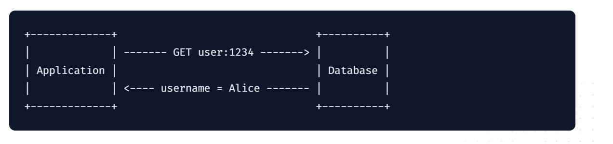
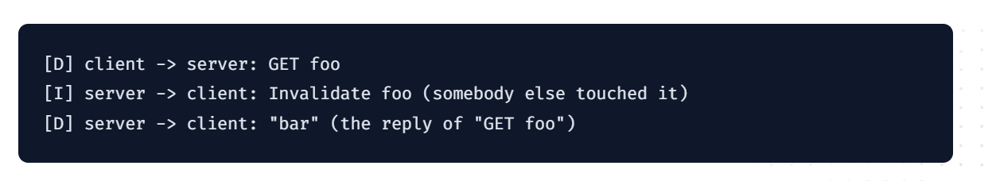
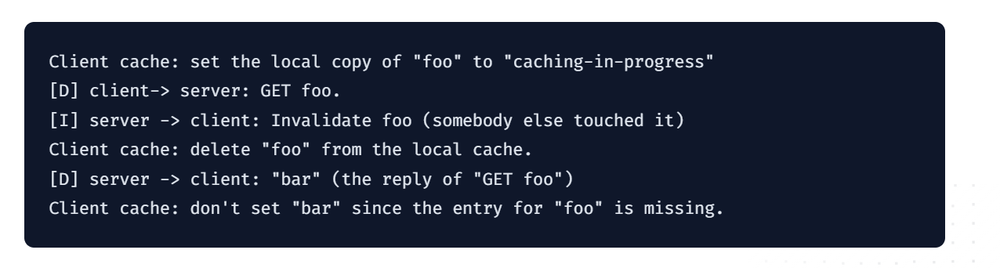

# Client Side Caching in Redis

本文為此篇 [文章](https://redis.io/docs/manual/client-side-caching/) 的筆記。
## Foreword

本文的 Client Side caching in Redis 為以下架構：
- 以 Redis 當作主要 Database （不是作為 cache 使用）
- Client side cache 指的是 Application(Server machine) 的 local memory cache。
- 本文內的 Client 指的是 Application，Server 指的是 Redis Server(Database)
## Introduction
Client side cache 對提升系統效能有很大的幫助。當 Application 發送請求到 Database，並從 Database 拿到某筆資料後便可以把資料存在 Application 內的 Local memory。當下次要發送相同請求時，便可以直接從 Memory 拿取，而省掉與 Database 的溝通時間，以及 Database 跑 Query 的時間。

- 發送請求至資料庫，並把結果存在 Memory
- 下次請求時，不必與資料庫溝通！

通常 Cache 會存取 High Read 的資料。其他的特性如 Not frequently change 以及 Computed expensive 也可以考慮。

### Problems with above pattern
- 當資料發生變動時，如何去更新或刪除 Cache 裡的舊資料。
  - 尤其當系統內有多台 Machine 運行時，情況更複雜
- 可能解法
  1. Simple: Time-to-Live index(TTL)
     - 設定 Cache 資料的過期時間
  2. Complex: 偵測 Database 更新的 Event，當發生變動時通知 Cache 更改
     - 可以使用 Pub/Sub system。發生變動時 Publish message，並傳給所有 Subscribe 此 Event 的 Machine。
     - 缺點：
       - Pub/Sub 通常會送通知給所有 Machine，因為不知道誰有 Cache 資料，誰沒有。
       - 實作複雜

- Redis 6 支援了 Client-side caching，讓上述 Pattern 可以簡單且有效率的達成
## Implementation of Client side caching in Redis
Two modes
1. Default mode
   Redis Server(Database) 會記錄每個 Client 有存取過那些 Key，當 key 發生變動時，發送 invalidation 訊息給那些 Clients。
2. Broadcasting mode
   不紀錄誰存了哪些 key，發送通知給所有 Clients
- Default mode 需先 ENABLE TRACKING

- Redis Server 如何記錄 client-side caching?
  - Invalidation table（存在 memory)
    - 紀錄各個 Client 的 key 存取紀錄
    - 當 Table 滿了，則把 old key evict，並通知有記錄此 Key 的 client 當作這個 key 已經過期。

## Two connections mode
舊的 Protocol 中 (RESP2)，Client 會需要使用兩個 Connection 來與 Server 溝通。
- 其中一個 Client 負責發送 Query
- 其中一個 Client 負責接收 Invalidation message

新的 Protocol 中 (RESP3) 可以只用一個 connection 就做到 Query 跟接收 Invalidation
- 但當 Client 主動發送訊息後才會接收到 Invalidation

## What tracking tracks?
- 預設情況下，Client 不需要告訴 Server 他們需要 cache 的 key 有哪些
  - Server 會 cache 所有被讀的 key
- Tradeoff
  - Cache All key
    - Client server 溝通成本較低
    - Server 會須存取較多資料，且 Client 可能接收到無用的 invalidation 訊息
  - Cache specific key
    -  Client server 溝通成本較高
### Cache specific key
- OPTIN
  - Client 主動告訴 Server 該 cache 那些 key
    - 當 Read 前發送 CACHING YES 告訴 server 下個 read 要 cache
  -   
## NOLOOP option
當目前 Client write 時，自己不會接收到 invalidation message。

## Avoid Race condition
當發送 Read 後，在收到回覆前就收到 invalidation message，可能會造成 race condition
- Invalidate 後的 Response 可能會寫入 cache

- 解決方法為在發送 Read query 時，同時也在 local 記錄此行為。這樣在後續處理就不會有問題

## What to cache
- 我們想要 cache 的 key 應該要符合：
  - 很常被讀
  - 變動頻率在一個合理的範圍內
## Other hints
- 在 Read server 時也順便紀錄 TTL

## Reference:
- https://redis.io/docs/manual/client-side-caching/
