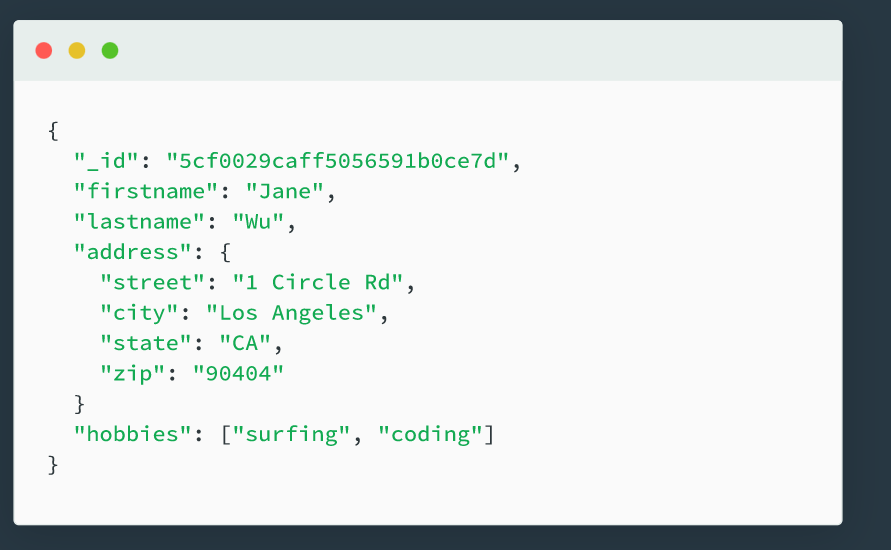

# What is a Document Database?

定義: 將資料以文件(Document)的格式去儲存

## What are Doucments?
Document將資料以Field-value 對的方式儲存，常見的格式為JSON。
由於此特性，value也可以儲存較複雜的資料結構，像是Array或是embedded document。

## Collections
Collection為相關Document的集合。同個Collection的不同Document可以有不一樣的field，甚至是同個field可以有不同的type。

## Advantage of Document Database
- 直觀的Data model
  - 文件格式與程式內的Object格式相像，讓開發者可以較快速的去儲存資料
- 彈性的Schema
  - 沒有硬性規定schema，可以適應變動
## Compare with Relation database
- 較直觀的Data model
  - 在RDB中，通常為了讓程式內的object轉成Database的格式，會使用Object Relational Mapping(ORM)，但這樣做卻增加了複雜性。
  - RDB通常需要做Normalization，導致一筆query可能會需要join多個table才能拿到想要的資料。相關聯的Document會儲存在同個Collection裡，在某些情況下讓一筆query就可以拿到所有想要的資料。
- 使用常見的JSON格式
- 較彈性的Schema
  - 讓使用者不必預先確定好Schema便可以先快速地做開發。後續若需要變動也可以很彈性的做到。
  - Document Database也可以做到Schema validation來確保開發順利。

## Reference
- https://www.mongodb.com/document-databases
- https://www.mongodb.com/compare/relational-vs-non-relational-databases