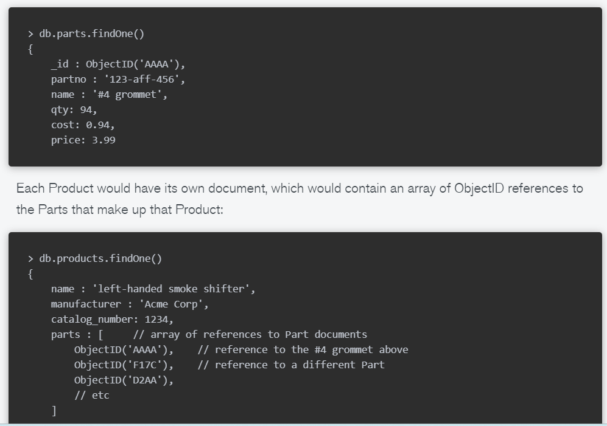

# MongoDB Schema Design Pattern

## Foreword
MongoDB 為 [Document Database](./DocumentDB.md)，是一種 NoSQL 資料庫。

因此，在資料庫的 Schema 設計上會跟 SQL 有些不同的地方。
舉例來說，像是一般的 one-to-many relation，在 Document Database 會需要想的更深，要考慮這個 relationship 的 cardinality 有多少，進而拆成 one-to-few, one-to-many, one-to-squillions

## One-to-few
舉例來說：Person 與 Adress 的關係。

這樣的好處是 Query 只需要一次就可以把資料取回，缺點是無法較難針對 embedded document 去做查詢。

## One-to-many
舉例來說：產品 (Product) 與零件 (Part) 的關係
通常一個產品可能會有幾百的零件，但不會超過千的量級。

在這種情況下，每個零件會有各自的 Document，而產品 Collection 則利用 reference（存取零件 id) 來做到關聯性。

當有需要對產品及零件做 Query 時，可以使用 Application-level join 來達成。
- Application level join: 
  在 Application 層做 join，因此如下圖所示會需要兩筆 Query 來達成
  - 第一筆 Query 拿到想要的 Product，以及 Parts 的 id
  - 第二筆 Query 把這些 id 跟與 Parts collection 做 join

這種作法與第一種 embedding 的做法相比，Trade off 為
1. Embedding 的 Read 速度較快
2. Reference 可以針對各自不同的 collection 做查詢及更新

*Note: Product 與 Part 的關係有可能為 N-to-N，假如不同 Product 可以共用零件*

## One-to-squillions
舉例來說：像是 Host 與 Log，一個 Host 可能會有非常多的 Log

這種情況可以讓 log 去儲存 host id，用來知道此 log 屬於哪個 host
同樣地也可以利用 Application join 去做查詢

## Recap
從以上的例子來看，在設計 schema 前需先考慮兩個問題

1. 在 One-to-N 裡，N 那邊的資料是否有需要被獨自查詢或修改？
2. One-to-N 的 cardinality 為何？

## Two-way referencing
把在 One-to-many 與 One-to-squillion 使用到的模型做結合，讓兩邊都存彼此的 id。
- 可以用在 One-to-Many 或是 Many-to-Many 的情況下
E.g. 上述 Products 跟 Parts 的例子中，Parts 在多一個欄位存他是屬於哪個 Product 的

這樣做的好處是在 Relation 的兩邊都可以去做 Query。
缺點為
1. 需要多存一個欄位
2. 當需要修改資料時，兩邊的 Collection 都需要被修改
   
## Denormalization with one-to-many relationship
在使用以上 Model 時，可以適度地依照需求，去做 denormalization 來增加效率
- 可以避免使用 application level join
  - TradeOff: denormalization 為修改增加了複雜度

### Database denormalization from many to one

延續上述 Products 的例子，若系統的 Query 常常需要取得 Parts 的 name，可以把 Name 做 denormalize，多寫到 Product collection 裡面。

這樣當 Query Products 時又只需要 Parts name 的資料，就不必做 application level join。
- Note: 做 Denormalization 要考慮到 read/write ratio。若這個 field 有 high read ratio，而且較少改變，則可以考慮 denormalization。

## Database denormalization rule:
1. 使用 Embedding document
2. 當被 embedded 的 document 需要單獨被查詢、更動，則使用 reference
3. Document 裡的 Array 不能無上限的擴張。(Document 有 16MB size limit) 如果 Array 大小會超過幾千的量級，則考慮使用 one-to-squillion 的 model 方法。
4. 不用害怕 application level join。若有設定好 index 則不會比 database-side join 差太多 ($in Query 也可以利用 index)。
5. 觀察 document field 的 read-to-write ratio，並考慮做 denormalization
6. 根據要開發的 Application 的特定資料格式去做 schema design

## Reference
- https://www.mongodb.com/blog/post/6-rules-of-thumb-for-mongodb-schema-design
- https://www.mongodb.com/developer/products/mongodb/schema-design-anti-pattern-summary/
