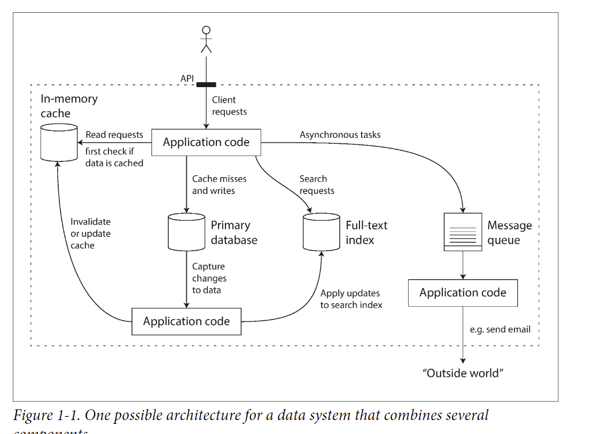
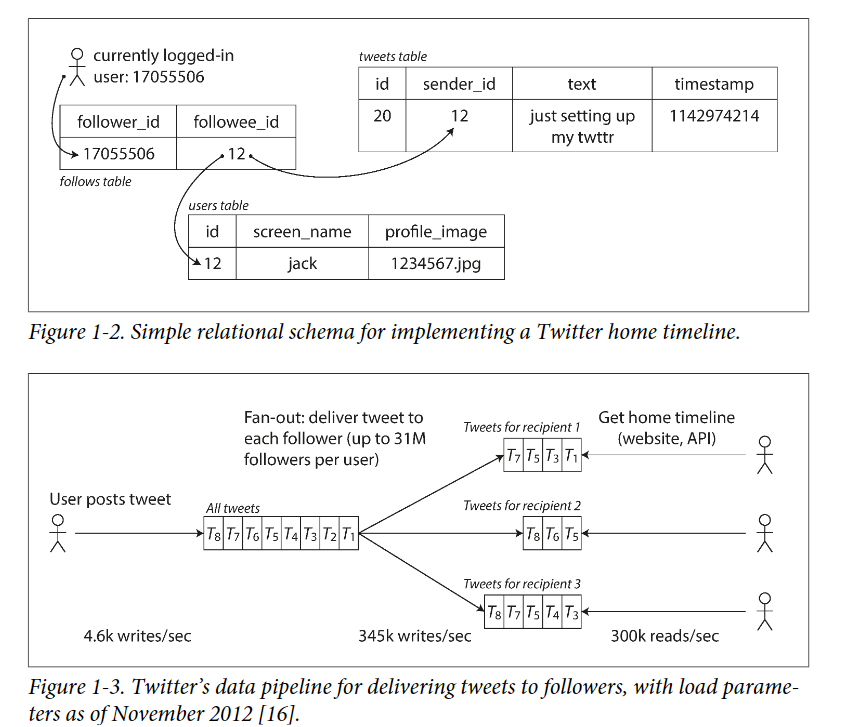
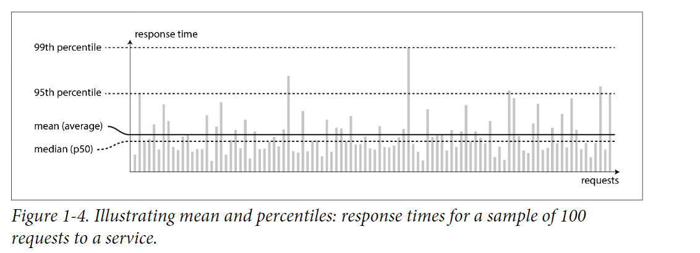
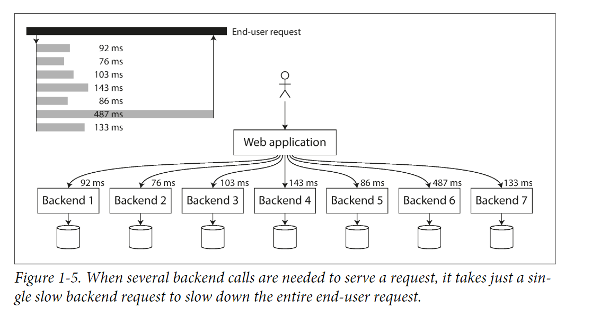

# Ch1 Reliable, Scalable, and Maintainable Applications

# Introduction

- Data-intensive v.s compute intensive
    - Most application are data-intensive, cpu power is not a limiting factor
    - Most problems: amount of data, complexity of data.
    - Supplementary:
        - Single-threaded web server (NodeJS) v.s. multi-threaded web server (Golang)

## Standard building block of an application

- Store data persistently. (Database)
- Remember result of expensive operation. (Cache)
- Search data by keywords. (Search indexes)
- I**ngesting a continuous data stream to quickly analyze, filter, transform or enhance the data in real time**(Stream processing)
- Periodically process large amount of data (Batch processing)

### About these building blocks

- These data system are successful abstraction.
    - E.g. Developer doesn’t need to write a new database from scratch.
- Same category of data system may have many different characteristics
    - E.g. Many different implementation of Database, Various approach to caching.
- Figure out which tools and which approaches are the most appropriate for our app.

## Thinking About data systems

- The traditional categories becomes blur
    - E.g. Redis can be a datastore, and also used as message queues.
- A single tool can no longer meet all needs.
    - E.g. Cache, full-text search, and database
    - It’s the application’s responsibility to sync data within these componenets.
        - Now, you’re both an application developer and a data system designer.
    
    
    
- How to ensure the whole data system work correctly?
    - E.g.
        - How to ensure data remain correct and complete when something go wrong?
        - How to provide consistently good performance to clients when some part of system degrade?
        - How to scale when increase in load?
    - Focus on three important concerns in most software systems
        - Reliability
            - System continue to work correctly even when fault occurs.
                - Fault included: Hardware, software faults, human error.
        - Scalability
            - Ways to handle when the system grows in data or traffic volume.
        - Maintainability
            - People should be able to work on it productively.

## Reliability

- Roughly meaning: “Continuing to work correctly, even when things go wrong”
- faults:
    - One component of the system deviating from its spec.
    - c.f. failures: The whole system stop providing service.
- System that anticipate faults and can cope with them are call fault-tolerant or resilient
- How to test a system is fault-tolerant?
    - Deliberately generate faults.
    - E.g. Netflix Chaos Monkey: randomly kill instance and see whether service works fine.

### Hardware Faults

Examples: 

- Hard disk crash, power blackout, someone unplug network cable, etc.
- Hard disk’s Mean time to Failure (MTTF)
    - 10~50 year.
- First solution: Add redundancy in component
    - Set up disk in a RAID configuration.
    - Dual power supplies for server.
    - Idea: When one component die, the redundant component can take its place.
    - Result:
        - Make total failure of a single machine rare.
        - Multi-machine redundant is not necessary.
- Trends:
    - As data volume and application’s computing increased, more app use larger number of machines.
    - It’s common that vm provided with cloud provider become unavailable without warning.
        - Platform is designed to prioritize flexibility and elastic over single-machinie reliability.
- Second solution: Using software fault-tolerance technique in preference
    - System should tolerate the single-machine shutdown.
    - Advantages:
        - Can perform rolling upgrade:
            - Reboot a machine to security patch, one node at a time, while other machine can still maintain the service without downtime.

### Software Faults

- Hardware faults are random and independent.
- Software faults(Systematic faults) are harder to anticipate, and may have relation between faults.
- Examples:
    - Given a bad input cause the whole system crash
    - A process that exhaust all CPU, memory resource.
- Solutions:
    - Carefully thinking about assumption and interaction in the system.

### Human errors (similar to software faults)

How to build reliable system without human errors:

- Design system that minimize opportunities of errors
    - E.g. Well-designed abstraction
- Testing
    - From unit test to end-to-end test, use automated test.
- Allow quick and easy recovery from human errors
    - Fast to rollback and gradually roll out new code.
- Set up detailed monitoring and alerting.

## Scalability

### Describing Load

Succintly describe current load of system.

- Load can be described with a few number called load parameters.
- Load parameters including:
    - rps, r/w ratios, cache hit rate, etc.
    - Observe the average and extreme cases.
- Example: Tweet
    - Two API
        - User post tweet
        - Browse home timeline (should see the followees’ posts)
    - Two different ways to handle
        1. Method 1
            - User post tweet: Directly write into database. (fast)
            - Browse Timeline: Perform join on database for all followees’ post. (slow)
        2. Method 2
            - User post tweet: Write post to all follower’s individual cache. (slow, many write)
            - Browse Timeline: Directly fetch from cache. (fast)

---

- Initially, Twitter use method 1, but system load home timeline slowly.
    - We can found that home timeline query is more frequent than post tweet.
    - Hence, it consider method 2.
- For method 2, posting tweet may cost lots of time.
    - Firstly, we observe the average followers of each user is 75. So the write cost should * 75.
    - However, we omit the fact that some celebrity have extreme high followers(30 million), which can cause high write suddenly.
- For twitter, the distribution of followers per user is the key load parameter.
- Finally, twitter use a hybrid approach.
    - For normal user, use method 2.
    - For specific celebrity, use method 1.
    - When browsing timeline, merge the local cache and the join result from db.
    - Ref: [https://github.com/donnemartin/system-design-primer/blob/master/solutions/system_design/twitter/README.md](https://github.com/donnemartin/system-design-primer/blob/master/solutions/system_design/twitter/README.md)

### Describing performance

In online system, service’s response time is more important to describe performance.

- Response time: The time between client send request and receive response.
- Every try may have different response time.
- Measure as distribution.

- We should take care of outliers seriously.
    - Perhaps the slowest request is from a more valuable customer because they usually have more data to load.
- Use percentile instead of average to tell how many customer actually experienced delay easily.
    - E.g. p50: median percentile, p90, p99
    - Amazon describe performance in terms of p99.9.
- Head-of-line blocking
    - Server is blocked at a slow request and can’t handle subsequent request.
    - Even if subsequent request is fast to process, client still feel high response time.
- Tail-latency amplification
    - When an incoming request need to call other backend services, the slowest request is the bottleneck.
    - The probability for client to meet slow request is higher.
    
    
    

### Approachs for coping with load

- Scale up (vertical scaling)
- Scale out (horizontal scaling)
    - Scale out is cheaper than scale up.
    - Elastic
        - Automatic scaling by observing some metric.
    - Stateless v.s. Stateful
        - Stateful: Take Stateful data system from one node to a distributed setup introduce lots of complexity.
        - Stateless: Share-nothing architecture.
            - Distribute load across multiple machine. (stateless)
- There is no one-size fit all scalable architecture
    - Scaling is highly specific to application.
    - Different problem. E.g. r/w volume, data volume, etc.
- Determine which operations are common and which operations are rare.
    - Decide important load parameter.

## Maintainbility

- Majority cost of software is the **ongoing maintenance**.
    - E.g. fix bugs, keep system operational, investigating failures, pay tech debt, etc.
- We should design software in a way that minimize pain during maintenance and avoid legacy software ourselves.
- Three design principles for softwrae systems:
    - Operability
        - Make it easy for Op teams to keep system running.
    - Simplicity
        - Make it easy for new engineer to understand the system by removing complexity.
    - Evolvability
        - Make it easy for engineer to make changes to the system in the future.
        - A.k.a extensibility, modifiability, plasticity.

### Operability

Operation teams are vital to keeping a software running smoothly.

Responsibility:

- Monitoring the health of system, and quickly restoring service if it’s shutdown.
- Tracking down the cause of problem.
    - Logging
- Keeping softeware and platforms up to date, including security patches.
- Establishing good practice and tools for deployment, configuration management and more.

---

- Good operability means making routine tasks easy.
- Data systems can do various things to make routine tasks easy:
    - Visibility into the runtime behavior of the system
    - Good support for automation and integration with tools.
    - Provide Documentation.
    - Rolling upgrade
    - Self-healing

### Simplicity: Manage complexity

- Possible symptons of complexity:
    - Extra state space
    - Tight coupling of modules
    - Tangled dependency (cyclic dependency ?)
    - inconsistent naming.
    - Special-case to workaround issue.
- Complexity system drawbacks
    - Greater risk of introducing bug when making a change because
        - system is harder to understand
        - hidden assumption
- Tools for remove unnecessary complexity: Abstraction
    - Hide implementation detail behind a clean, understandable interface.
    - easy to use for other applications.
- E.g. SQL is an abstraction that hide complex on-disk and in-memory data structure, concurrent requests from other clients (Still need to consider), and inconsistent after crash.

### Evolability: Make change easy

- Agile development: Adpating to change easily.
    - TDD (Test-driven design)
    - Refactoring.

## Summary

- Reliability
    - System continue to work correctly even when fault occurs.
        - Fault included: Hardware, software faults, human error.
- Scalability
    - Ways to handle when the system grows in data or traffic volume.
- Maintainability
    - People should be able to work on it productively.